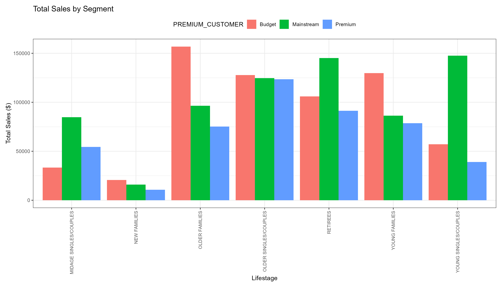
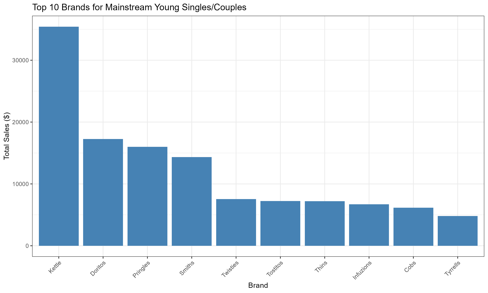
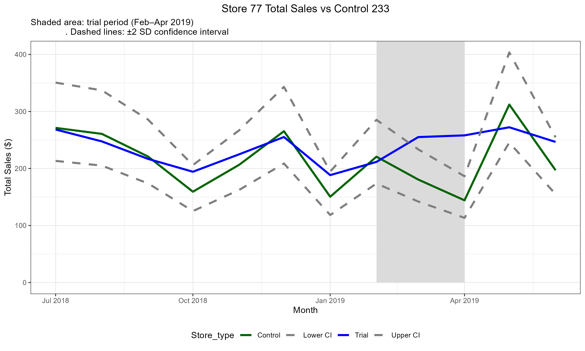
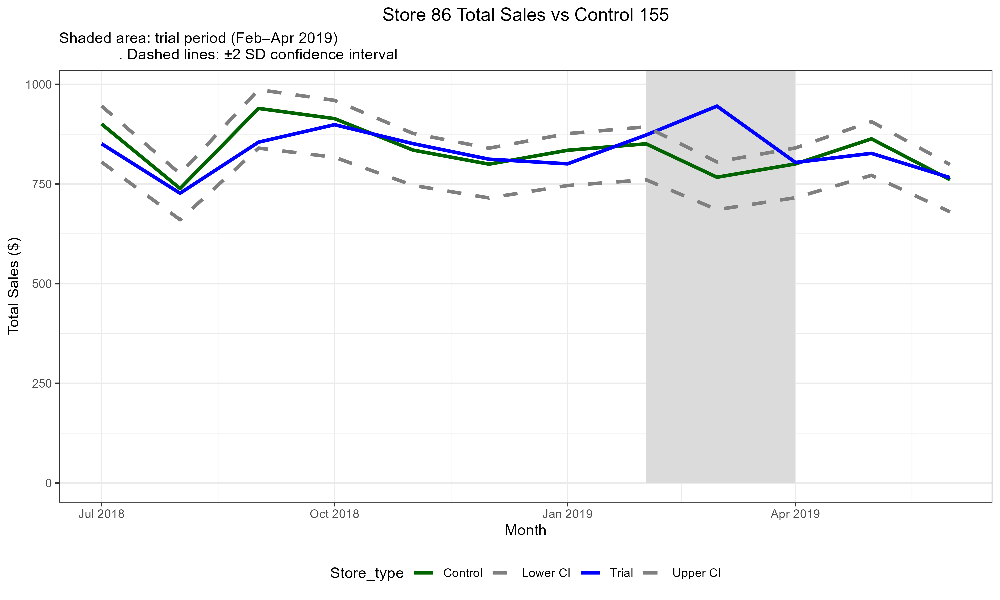

# 📊 Quantium Retail Analytics: Chips Category Review & Store Trial Performance

**Author**: Sushant Kumar Yadav  
**Domain**: Retail Analytics & A/B Testing  

## 📑 Executive Summary
This repository contains a comprehensive data analysis of the chips category and a performance evaluation of a new store layout trial for a retail client, covering data from July 2018 to June 2019[cite: 7]. The project is divided into two primary phases: Customer Segmentation (Task 1) and Control Store A/B Testing (Task 2)[cite: 7]. 

**Key Business Recommendations:**
* **Rollout the new layout** to stores structurally similar to trial stores 77 and 88. Both stores demonstrated statistically significant uplifts in sales and customer acquisition during the trial[cite: 7].
* **Investigate localized pricing/promotions** at Store 86 before broader deployment. The layout successfully attracted customers, but failed to convert them into incremental revenue[cite: 7].
* **Target Mainstream Young Singles/Couples** as the primary demographic. Place the **Kettle brand (175g pack)** at eye level in the new layout to maximize returns from this high-margin segment[cite: 7].

---

## 📂 Repository Structure
* `/Raw`: Contains the raw dataset including `QVI_purchase_behaviour.csv` and `QVI_transaction_data.xlsx`.
* `/Pdf`: Contains the compiled PDF reports showcasing the R code, outputs, and console tables.
* `/Charts`: Contains high-resolution data visualizations categorized into `Task1` and `Task2`.
* `*.Rmd files`: The original R Markdown scripts used for data wrangling and statistical analysis.
* `Quantium_Chips_Category_Review.pptx`: The final executive presentation summarizing insights for stakeholders.

---

## 🛠️ Tech Stack & Methodology
* **Language**: R[cite: 5, 6]
* **Libraries**: `data.table`, `ggplot2`, `lubridate`, `readxl`, `stringr`[cite: 5, 6]
* **Statistical Methods**: Data Wrangling, Welch's Two-Sample T-Test, Control/Trial Store Matching (Pearson Correlation & Magnitude Distance), 95% Confidence Intervals[cite: 5, 6, 7].

---

## 📈 Task 1: Customer Segmentation & Purchasing Behavior
The goal was to establish *WHO* to target by analyzing 21 distinct segments (7 lifestages × 3 affluence tiers)[cite: 7]. 

### Key Insights:
* **Volume vs. Value Driver:** Older Families (Budget) lead the category in raw volume, generating $156,863.75 in total sales[cite: 5]. However, Mainstream Young Singles/Couples present the highest strategic value[cite: 7].
* **Premium Pricing:** Mainstream Young Singles/Couples pay the highest average price per unit at $4.07[cite: 5]. A Welch t-test confirmed this premium pricing is statistically significant (t = 37.624, p-value < 2.2e-16) compared to non-mainstream counterparts[cite: 5].
* **Hero SKU Identified:** Within this target segment, **Kettle** is the undisputed top brand, generating $35,423.60 in sales[cite: 5]. The **175g pack size** is the primary revenue driver, contributing $37,967.90[cite: 5].

### Visualizations:

*Figure 1: Older Families (Budget) and Mainstream Young Singles/Couples drive the highest total sales.*

*Figure 2: Kettle dominates brand preference among the highest-paying demographic.*

---

## 🏬 Task 2: Store Layout Trial Analysis (A/B Testing)
The objective was to evaluate the effectiveness of a new store layout implemented in February 2019[cite: 7].

### Methodology:
* Pre-trial data (Jul 2018–Jan 2019) was used to score and match all stores based on a 50/50 blend of Correlation and Magnitude Distance for both Total Sales and Customer Count[cite: 6].
* **Identified Control Matches:** Store 77 matched with 233, Store 86 with 155, and Store 88 with 237[cite: 6].
* **Significance Testing:** Declared significant when the trial store's t-value breached the ±2 Standard Deviation (95% CI) threshold in ≥2 of the 3 trial months (Feb-Apr 2019)[cite: 6, 7].

### Trial Results:
* **Store 77 (Matched to Control 233)**: Delivered a clear, statistically significant uplift. Sales t-values hit 2.94 (Mar) and 5.92 (Apr), while Customer t-values hit 6.15 (Mar) and 15.13 (Apr)[cite: 6]. **Decision: ROLLOUT**[cite: 6].
* **Store 88 (Matched to Control 237)**: Replicated Store 77's success, with Sales significantly up in March (t=3.37) and April (t=1.99)[cite: 6]. **Decision: ROLLOUT**[cite: 6].
* **Store 86 (Matched to Control 155)**: Customer traffic surged significantly (t=4.03 in Feb, t=5.36 in Mar), but sales uplift was *not* sustained (only significant in March)[cite: 6]. This divergence strongly points to a localized pricing/promotion issue rather than a layout failure[cite: 7]. **Decision: INVESTIGATE**[cite: 6].

### Trial Visualizations:

*Figure 3: Store 77 showing clear sales uplift breaching the +2 SD confidence interval during the trial period.*

*Figure 4: Store 86 showing a drop back within the confidence interval bounds, failing to sustain sales conversion.*
