# 📊 Quantium Retail Analytics: Chips Category Review & Store Trial Performance

**Author**: Sushant Kumar Yadav  
**Domain**: Retail Analytics & A/B Testing  

## 📑 Executive Summary
This repository contains a comprehensive data analysis of the chips category and a performance evaluation of a new store layout trial for a retail client, covering data from July 2018 to June 2019. The project is divided into two primary phases: Customer Segmentation (Task 1) and Control Store A/B Testing (Task 2). 

**Key Business Recommendations:**
* **Rollout the new layout** to stores structurally similar to trial stores 77 and 88. Both stores demonstrated statistically significant uplifts in sales and customer acquisition during the trial.
* **Investigate localized pricing/promotions** at Store 86 before broader deployment. The layout successfully attracted customers, but failed to convert them into incremental revenue.
* **Target Mainstream Young Singles/Couples** as the primary demographic. Place the **Kettle brand (175g pack)** at eye level in the new layout to maximize returns from this high-margin segment.

---

## 📂 Repository Structure
* `/Raw`: Contains the raw dataset including `QVI_purchase_behaviour.csv` and `QVI_transaction_data.xlsx`.
* `/Pdf`: Contains the compiled PDF reports showcasing the R code, outputs, and console tables.
* `/Charts`: Contains high-resolution data visualizations categorized into `Task1` and `Task2`.
* `*.Rmd files`: The original R Markdown scripts used for data wrangling and statistical analysis.
* `Quantium_Chips_Category_Review.pptx`: The final executive presentation summarizing insights for stakeholders.

---

## 🛠️ Tech Stack & Methodology
* **Language**: R
* **Libraries**: `data.table`, `ggplot2`, `lubridate`, `readxl`, `stringr`
* **Statistical Methods**: Data Wrangling, Welch's Two-Sample T-Test, Control/Trial Store Matching (Pearson Correlation & Magnitude Distance), 95% Confidence Intervals.

---

## 📈 Task 1: Customer Segmentation & Purchasing Behavior
The goal was to establish *WHO* to target by analyzing 21 distinct segments (7 lifestages × 3 affluence tiers). 

### Key Insights:
* **Volume vs. Value Driver:** Older Families (Budget) lead the category in raw volume ($156,863.75). However, Mainstream Young Singles/Couples present the highest strategic value.
* **Premium Pricing:** Mainstream Young Singles/Couples pay the highest average price per unit at $4.07. A Welch t-test confirmed this premium pricing is statistically significant (t = 37.624, p-value < 2.2e-16).
* **Hero SKU Identified:** Within this target segment, **Kettle** is the undisputed top brand ($35,423.60). The **175g pack size** is the primary revenue driver ($37,967.90).

### 📊 Task 1 Visualization Gallery:

  
  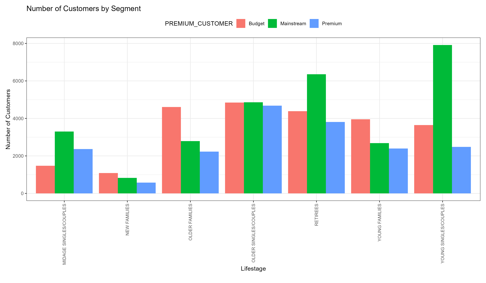

  
  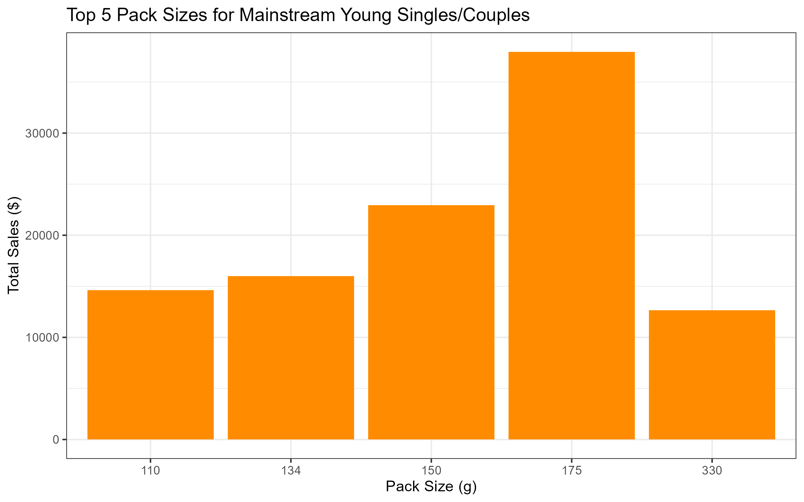

  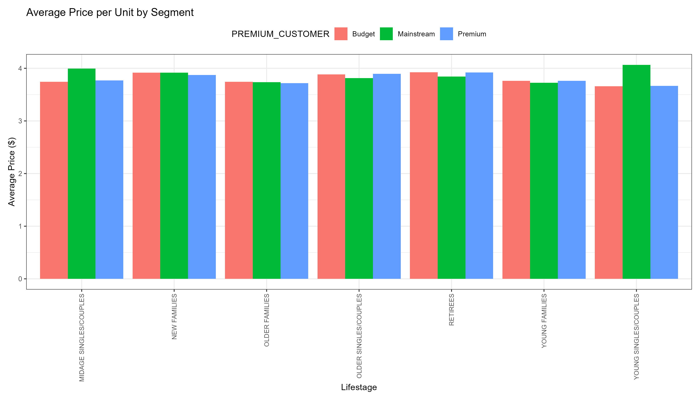

---

## 🏬 Task 2: Store Layout Trial Analysis (A/B Testing)
The objective was to evaluate the effectiveness of a new store layout implemented in February 2019.

### Methodology:
* Pre-trial data (Jul 2018–Jan 2019) was used to score and match all stores based on a 50/50 blend of Correlation and Magnitude Distance for both Total Sales and Customer Count.
* **Identified Control Matches:** Store 77 matched with 233, Store 86 with 155, and Store 88 with 237.
* **Significance Testing:** Declared significant when the trial store's t-value breached the ±2 Standard Deviation (95% CI) threshold in ≥2 of the 3 trial months (Feb-Apr 2019).

---

### 📊 Task 2 Visualization Gallery: Store Uplift & Benchmarking

#### 🟢 STORE 77 vs CONTROL 233 (Decision: ROLLOUT)
*Delivered clear, statistically significant uplift in both Sales (t=5.92 in Apr) and Customers (t=15.13 in Apr).*

  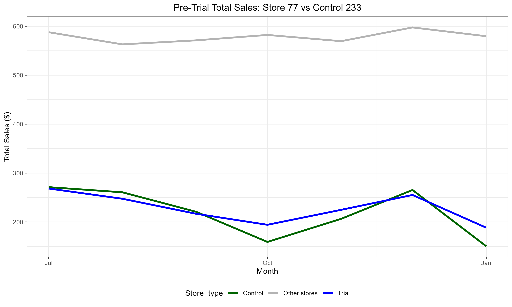
  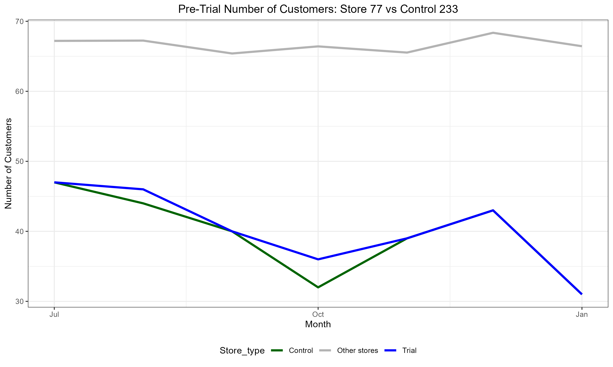

  
  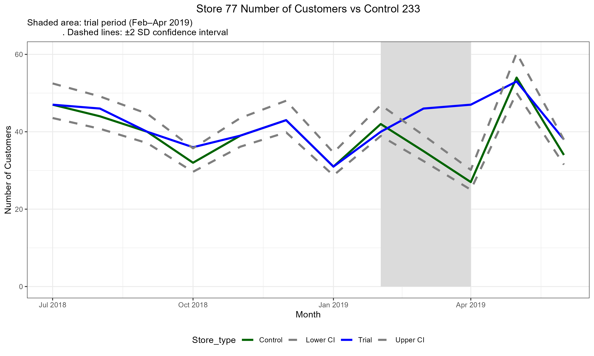

#### 🟢 STORE 88 vs CONTROL 237 (Decision: ROLLOUT)
*Replicated Store 77's success, with Sales significantly up in March (t=3.37) and April (t=1.99).*

  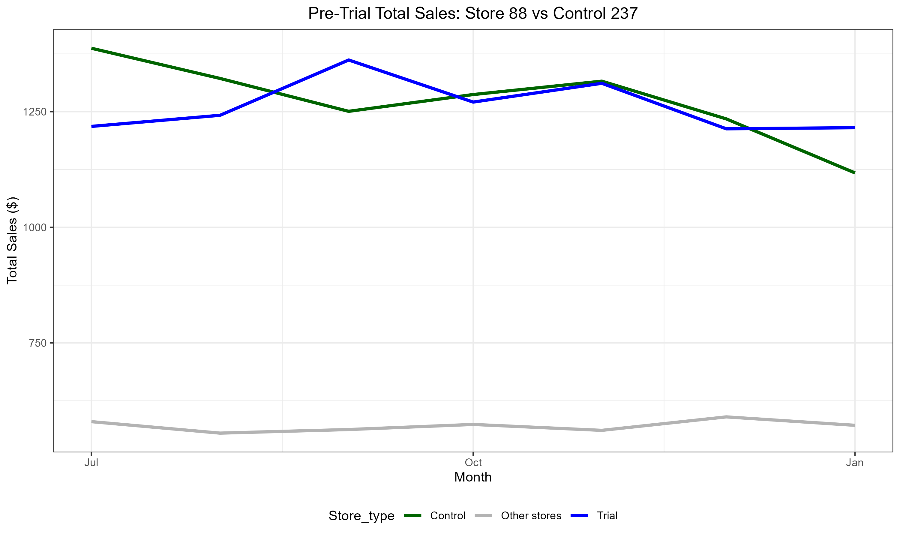
  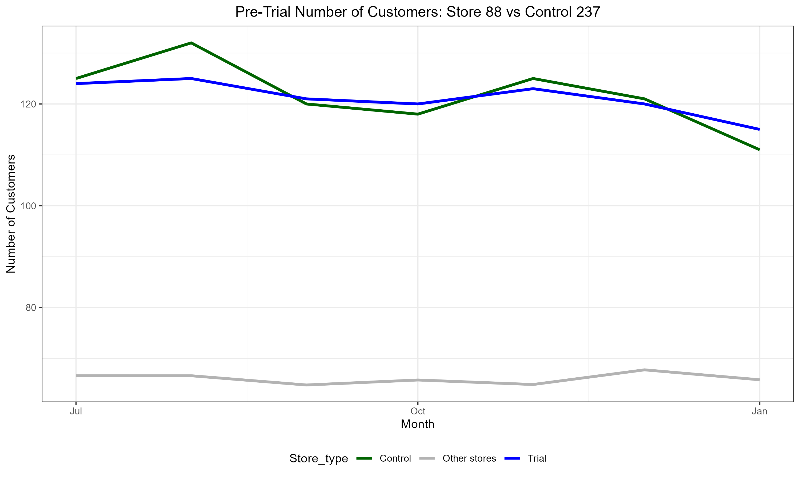

  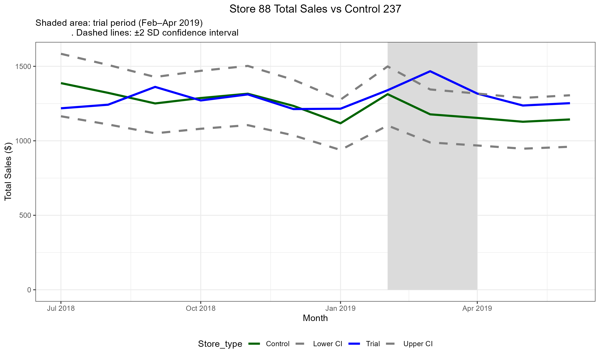
  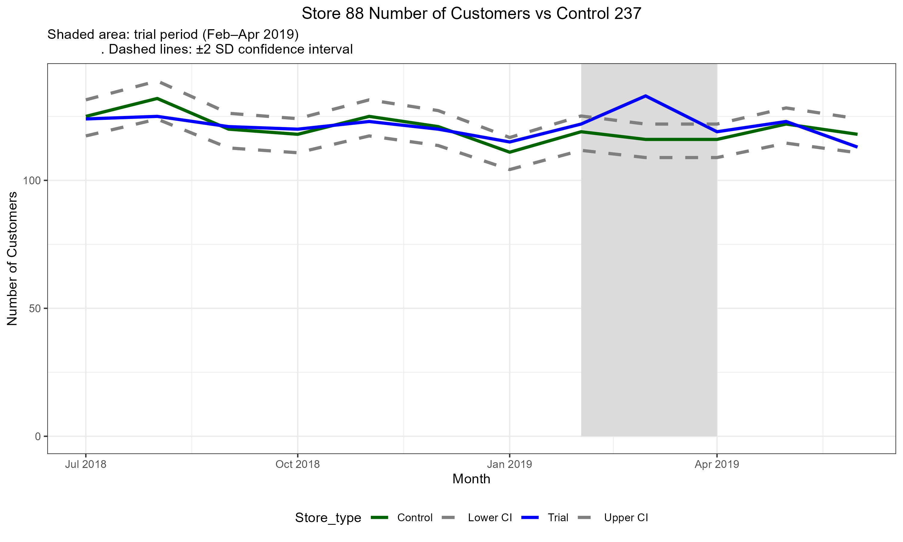

#### 🟠 STORE 86 vs CONTROL 155 (Decision: INVESTIGATE)
*Customer traffic surged significantly, but sales uplift was not sustained. Indicates a localized pricing/promotion issue.*

  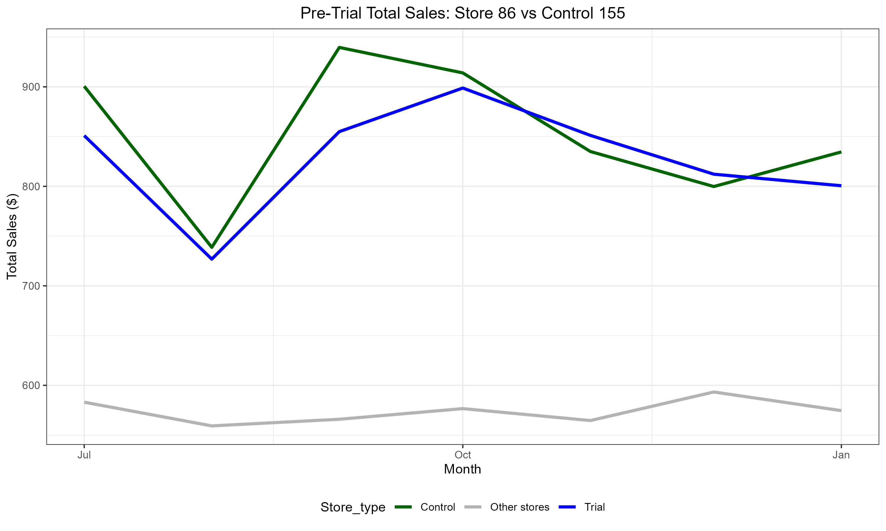
  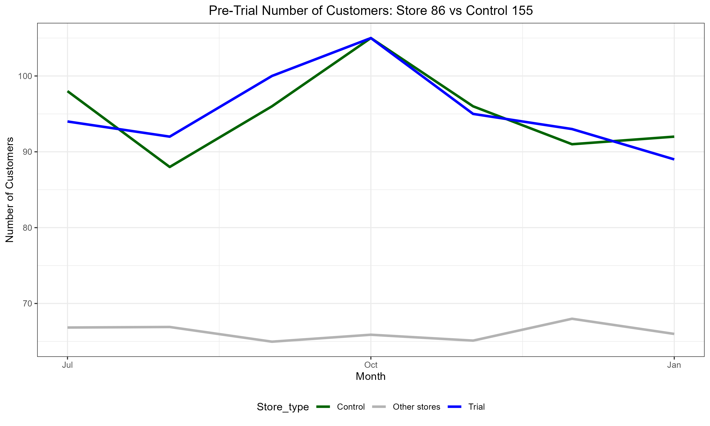

  
  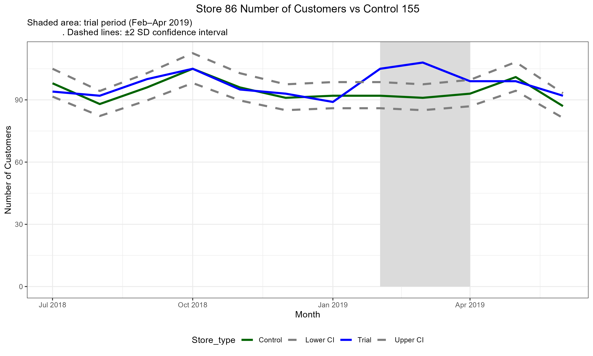

---
*End of Report*
